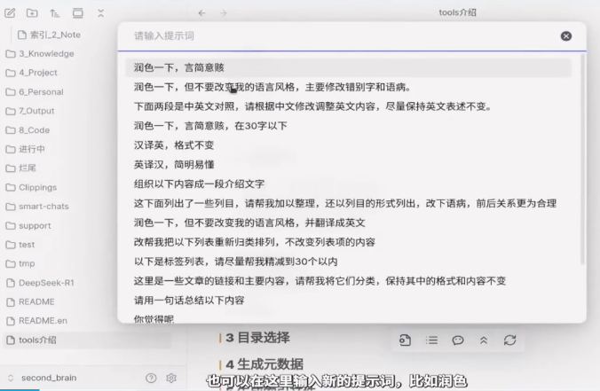

## 介绍

ExMemo Assistant 提供智能化的文档管理功能。结合大型语言模型（LLM）的能力，它能自动生成和更新文件的元信息，从而实现高效的信息管理和文档编辑。

生成并更新文件的元信息，包括标签、简述、标题、编辑时间等。

> **重要提示**：插件 [obsidian-exmemo-tools](https://github.com/exmemo-ai/obsidian-exmemo-tools/) 的功能目前已涵盖本项目所支持的所有内容，并新增了更多功能。后续开发和更新将以 exmemo-tools 为主，建议您迁移使用该工具。

### tools 使用方法视频介绍

## 使用方法

### 设置

在使用本工具前，请确保完成以下设置：

* 首先，设置与 LLM 相关的选项，包括 API 密钥、基础 URL 和模型名称。
* 如果使用自动生成标签功能，建议在使用前预先填写标签列表，或从当前仓库中自动提取已有标签，以便生成的标签更符合用户的风格。
* 若需修改生成简述的方法，请在设置中调整生成描述的提示词。
* 对于较长文章的元数据生成，调用模型时可能会产生较高费用，建议通过设置中的“内容截断”功能来控制成本。

### 生成元信息

通过按下 Ctrl+P，选择：ExMemo Assistant: 生成元数据。

生成标签和描述常常是个令人头疼的任务。我们经常会生成意思相同但写法不同的标签，这会对后续处理造成影响。为了解决这个问题，我们实现了自动生成标签的功能，每次可以自动生成三个标签。用户可以在设置中定义标签的范围，也可以从当前仓库中提取出现过两次以上的标签作为侯选项。对于文档短描述的生成，工具提供了默认的提示词，用户可以在设置中编辑提示词，以便定义自己的风格。

在生成标签和描述的过程中，需要将文档内容提供给 LLM。对于长度较长的文档，这可能会导致较高的费用。因此工具在设置中提供了截断功能，可以仅将文件的头部、首尾或文中标题传给模型。对于包含标签和描述的文档，可以在设置中选择不再重复生成这些信息，从而有效地控制费用。

此外，生成文件的标题、生成日期和编辑日期等操作虽然常用但却繁琐。我们的工具提供一键生成这些元信息，大大简化了日常工作流程。

## License

本项目采用 GNU Lesser General Public License v3.0 许可证。有关详细信息，请参见 [LICENSE](./LICENSE) 文件。

